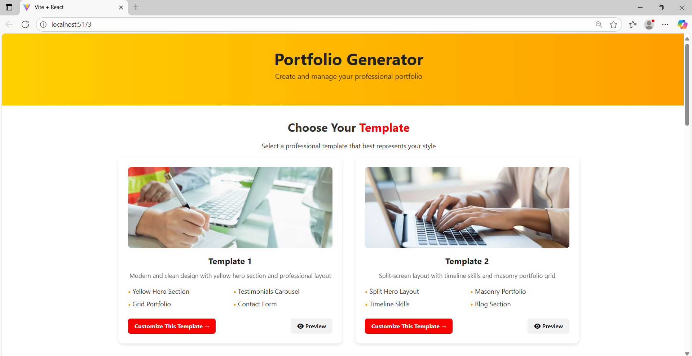
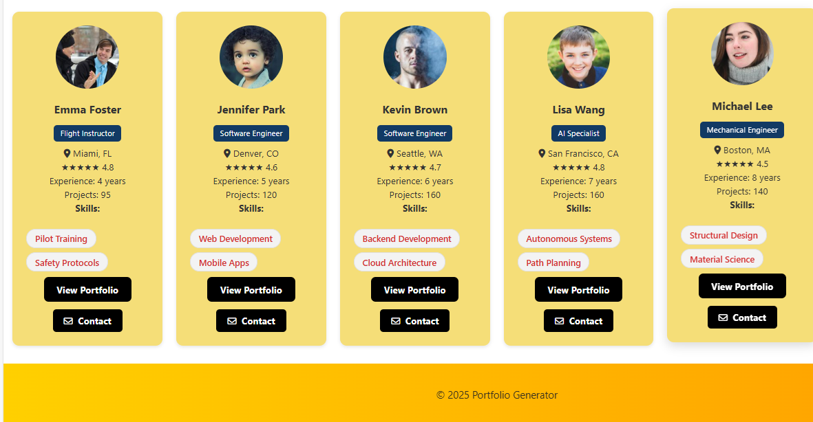
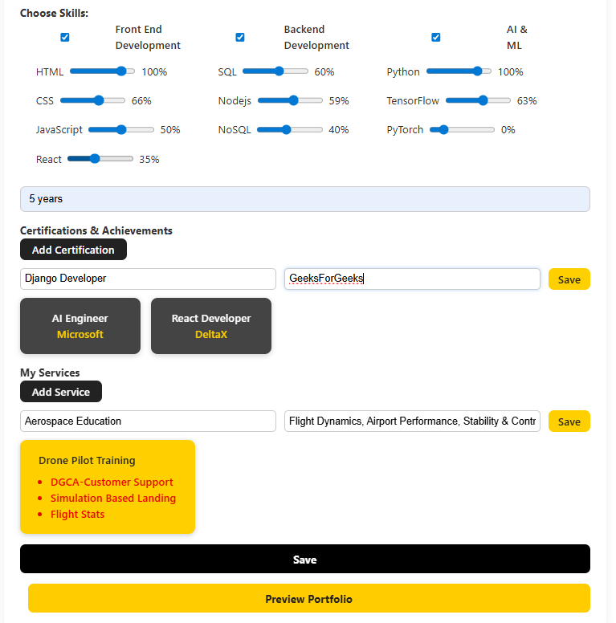
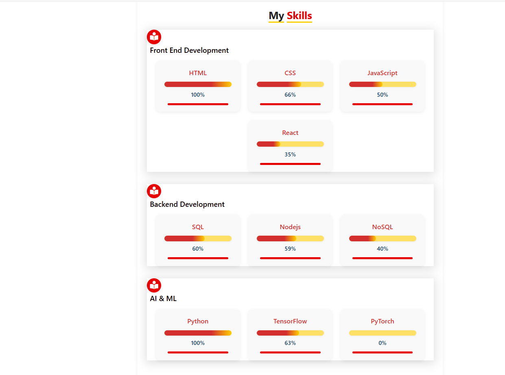
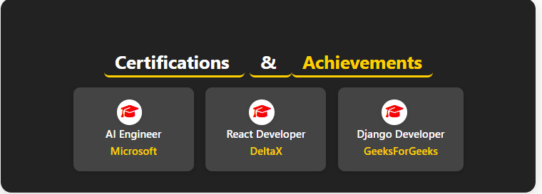

# 🏦 Portfolio Generator

A modern and interactive React-based web application that allows users to create, customize, and showcase professional portfolios with ease.
Users can enter details such as skills, certifications, achievements, and services, then preview and share a beautifully designed portfolio page.

---

## 🚀 Features

* 🎨 **Template Selection** – Choose from multiple professional portfolio templates.
* 📝 **Dynamic Multi-Section Form** – Add company details, contact info, skills, certifications, achievements, and services.
* 📊 **Skill Categories & Proficiency** – Organize skills by category (Frontend, Backend, AI & ML, etc.) with proficiency sliders.
* 🏅 **Certifications & Achievements** – Showcase certifications with issuing organization details in stylish cards.
* 💼 **Services** – Add and preview professional services with descriptions.
* 🔍 **Live Preview** – Instantly preview your portfolio as you build it.
* 📒 **Professionals Directory** – Browse and filter through listed professionals.
* 📱 **Responsive Design** – Optimized for both desktop and mobile devices.

---

## 🛠️ Methodology

1. **Component-Based Architecture:**  
   The app is split into reusable React components (`App`, `PortfolioPage`, `ProfileCard`, `TemplateSelection`, etc.) for maintainability and scalability.

2. **State Management:**  
   Uses React hooks (`useState`, `useEffect`) to manage form data, selected skills, certifications, services, and preview state.

3. **Dynamic Data Structure:**  
   - **Skills:** Stored as an object grouped by category, with each skill's proficiency set by the user.
   - **Certifications/Services:** Stored as arrays, allowing multiple entries.

4. **Live Preview:**  
   The form data is passed to the `PortfolioPage` component for instant preview, reflecting all changes in real time.

5. **Styling:**  
   - Uses modern CSS for layout, colors, and effects.
   - Section titles have yellow underlines.
   - Skills, certifications, and services are displayed in visually distinct containers.

6. **API Integration:**  
   - Uses Axios for fetching and saving professionals and templates.
   - Data is stored in a local `db.json` via `json-server` for development.

---

## 📁 Project Structure

```
portfolio-generator/
│
├── public/
│   └── index.html
├── src/
│   ├── api.js                # Axios API calls
│   ├── App.jsx               # Main app logic and state
│   ├── styles/
│   │   └── App.css           # Global and component styles
│   ├── components/
│   │   ├── Header.jsx
│   │   ├── TemplateSelection.jsx
│   │   ├── PortfolioPage.jsx
│   │   ├── ProfileCard.jsx
│   │   ├── PortfolioForm.jsx
│   │   └── PortfolioPage.css # Portfolio page styles
│   └── screenshots
├── db.json                   # Local database for professionals/templates
├── package.json
└── README.md
```

---

## ⚡ Getting Started

### 1️⃣ Install dependencies

```bash
npm install
```

### 2️⃣ Start development server

```bash
npm run dev
```

### 3️⃣ Start mock API (json-server)

```bash
npm run server
```

### 4️⃣ Open in browser

[http://localhost:5173](http://localhost:5173)


---

## 🖼️ Screenshots

Screenshots of the app in action:

* **Choosing Templates**


  

* **Basic Details Form**


  !(./screenshots/enter_basic.png)


* **Professionals Filtering**


  

* **Details of Stored Professionals**




* **Enter Basic Details**


  

* **Enter Skills**



* **Contact and Basic Details in Portfolio**



* **Certifications & Achievements**


  

* **Services of The User**

 

---


## 🎨 Customization

* Add more **skill categories, templates, or services** in `App.jsx`.
* Modify **styling** in `App.css` and `PortfolioPage.css`.
* Replace the **mock backend** (`json-server`) with a real API by updating `api.js`.

---

## 🤝 Contributing

Pull requests and suggestions are welcome!  
Feel free to fork, improve, and share.

---


